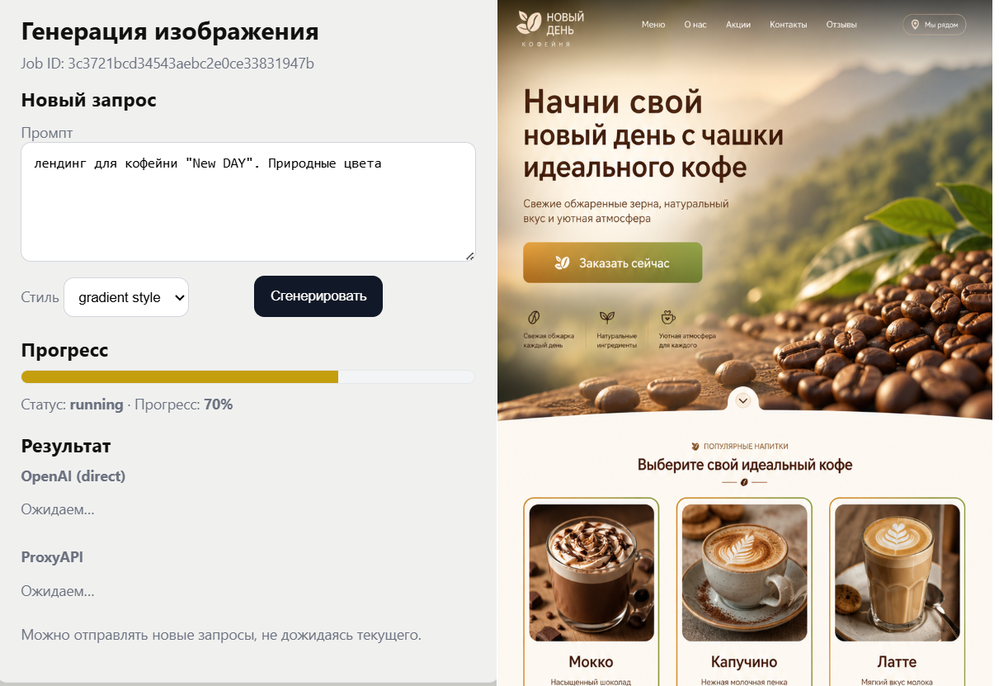

# 🎨 Генератор картинок для лендинга

**Простыми словами:** вы пишете, какой сайт хотите («лендинг для онлайн-школы», «страница для кофейни») — программа рисует **картинку-макет** этой страницы. Как эскиз дизайна, который можно показать заказчику или использовать как идею.

Работает через **искусственный интelligence (OpenAI)** — нужен платный ключ от сервиса.

**Пример результата:**

<p align="center">
  
</p>

---

## 💡 Удобство и выгода

- ⚡ **Быстрый старт** — визуализация идеи и подбор стиля примерно в **10 раз быстрее**, чем через агентство или фриланс. Пять картинок «как может выглядеть лендинг» в разных стилях — **до 30 минут** у вас vs **до 5 дней** у подрядчика.
- 💰 **Экономия на черновиках** — первые концепты и прототипы от **~15 ₽ за один запуск** (оплата нейросети) vs **от 10 000 ₽** в агентстве или **от 2 500 ₽** у фрилансера. На этапе «посмотреть идею» бюджет почти не уходит.
- 🧠 **Нейросеть дорабатывает вашу мысль** — вы пишете короткую фразу, система превращает её в подробное и аккуратное описание макета.
- 📋 **Готовый ориентир для дизайнера** — картинки-референсы можно отдать дизайнеру или верстальщику для финальной отрисовки сайта.

---

## ✨ Что вы получите на выходе

- 🖼️ **Картинку** размером 1024×1024 пикселей (формат PNG)
- 🇷🇺 **Текст на макете на русском** — заголовки, кнопки, меню
- 🎯 **Два варианта сразу** (если настроены оба ключа) — можно сравнить и выбрать лучший
- 📁 Файлы сохраняются в папку **`outputs`** на вашем компьютере

---

## 🧠 Как это работает (без сложных терминов)

1. **Вы описываете идею** — одной фразой, своими словами.
2. **Программа «дорабатывает» описание** — добавляет детали: где заголовок, кнопки, цвета и т.д.
3. **Нейросеть рисует картинку** по этому описанию.
4. **Результат показывается на экране** и сохраняется в папку.

⏱️ Обычно это занимает **1–3 минуты** — нужно подождать, не закрывайте окно браузера.

---

## 📋 Что нужно заранее

| Что | Зачем |
|-----|--------|
| 💻 Компьютер с **Windows** | Программа запускается локально у вас |
| 🐍 **Python** (версия 3.11 или новее) | «Движок» программы — [скачать с python.org](https://www.python.org/downloads/) |
| 🔑 **Ключ OpenAI** | Платный доступ к нейросети — [platform.openai.com](https://platform.openai.com) |
| 🔑 **Ключ ProxyAPI** *(не обязательно)* | Только если хотите **вторую** картинку для сравнения |

> 💡 **Ключ** — это длинная секретная строка, как пароль. Её **никому не показывают** и **не выкладывают в интернет**.

---

## 🚀 Как запустить (пошагово)

### Шаг 1. Откройте терминал в папке проекта

1. Откройте папку проекта: `C:\Users\Dominique\.cursor\image_landing_go`
2. В адресной строке проводника введите **`cmd`** или **`powershell`** и нажмите Enter  
   *(или: правой кнопкой по папке → «Открыть в терминале»)*

### Шаг 2. Один раз установите всё необходимое

Скопируйте команды **по очереди** и нажимайте Enter после каждой:

```powershell
py -m venv .venv
.\.venv\Scripts\Activate.ps1
pip install -r requirements.txt
```

> ⚠️ Если PowerShell ругается на «скрипты запрещены», выполните один раз от администратора:  
> `Set-ExecutionPolicy -ExecutionPolicy RemoteSigned -Scope CurrentUser`

### Шаг 3. Укажите свой ключ OpenAI

1. В папке проекта найдите файл **`.env.example`**
2. Скопируйте его и назовите копию **`.env`**
3. Откройте `.env` блокнотом и вместо `your_openai_api_key_here` вставьте **ваш настоящий ключ**:

```
OPENAI_KEY=sk-ваш_ключ_сюда
```

*(Второй ключ `PROXYAPI_KEY` можно не заполнять — тогда будет одна картинка вместо двух.)*

### Шаг 4. Запустите программу

В том же терминале:

```powershell
python app.py
```

Должна появиться строка вроде: **`Running on http://127.0.0.1:5000`** — значит, всё работает ✅

### Шаг 5. Откройте сайт в браузере

1. Откройте **Chrome**, **Edge** или другой браузер
2. В адресную строку вставьте:

```
http://127.0.0.1:5000
```

3. Нажмите Enter

---

## 🖱️ Как пользоваться сайтом

1. ✍️ **Напишите описание** — например: *«Лендинг для доставки пиццы, яркий, с большой кнопкой заказа»*
2. 🎨 **Выберите стиль** из списка (современный, минимализм, кибerpunk и др.)
3. ▶️ Нажмите **«Сгенерировать»**
4. ⏳ Подождите — полоска прогресса покажет, что идёт работа
5. 🎉 Готовые картинки появятся на экране — можно **сохранить** (правой кнопкой → «Сохранить изображение»)

---

## 🎨 Какие стили можно выбрать

| Название в списке | Примерно как выглядит |
|-------------------|------------------------|
| modern | Современно, аккуратно |
| minimalist | Мало деталей, много «воздуха» |
| professional | Деловой, строгий |
| UI/UX design | Как макет от дизайнера |
| gradient style | Яркие плавные переходы цветов |
| futuristic | «Будущее», неон, технологии |
| cyberpunk | Тёмный, неон, фантастика |
| cartoon | Мультяшный |
| sketch | Как набросок от руки |

---

## 📂 Где лежат готовые картинки

Все сохранённые файлы — в вашей папке.

```

Имена файлов начинаются с **`landing_openai_`** или **`landing_proxyapi_`** — по ним видно, какой сервис нарисовал вариант.

---

## 🛑 Как остановить программу

В окне терминала, где запущен `python app.py`, нажмите **Ctrl + C**.  
Сайт в браузере перестанет открываться, пока снова не запустите программу.

---

## ❓ Частые вопросы

**Страница не открывается**  
→ Убедитесь, что терминал всё ещё работает и там написано `Running on http://127.0.0.1:5000`. Если закрыли — снова выполните `python app.py`.

**Пишет «Не найден API-ключ»**  
→ Проверьте файл `.env`: есть ли строка `OPENAI_KEY=...` и правильный ли ключ (без лишних пробелов).

**Долго крутится и ничего не появляется**  
→ Подождите 2–3 минуты. Генерация картинки — не мгновенная. Проверьте интернет и баланс на аккаунте OpenAI.

**Нужен ли второй ключ (ProxyAPI)?**  
→ Нет. Без него вы получите **одну** картинку — этого достаточно для начала.

**Это бесплатно?**  
→ Сама программа бесплатная, но **OpenAI берёт деньги за каждый запрос** к нейросети. Следите за расходами в личном кабинете OpenAI.

**Можно без браузера?**  
→ Да, для продвинутых: в терминале команда  
`python generate.py "ваше описание"` — одна картинка сохранится в `outputs`.

---

## 🔒 Безопасность

- 🔐 Файл **`.env`** с ключами **не отправляйте** друзьям, в чаты и на GitHub
- 🚫 Не фотографируйте экран с ключом
- 💳 Ключ привязан к вашей оплате — берегите его как банковский пароль

---

## 💬 Кратко

| Действие | Команда или адрес |
|----------|-------------------|
| Запустить | `python app.py` |
| Открыть в браузере | http://127.0.0.1:5000 |
| Где картинки | папка `outputs` |
| Остановить | Ctrl + C в терминале |

Удачи с макетами! 🚀
